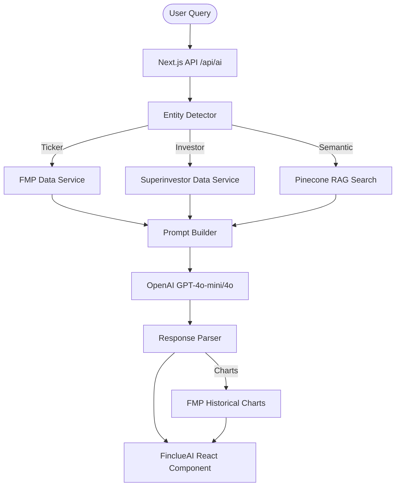

# Finclue AI Architecture

This document describes the architecture of the Finclue AI system to ensure long-term maintainability and clarity.

## System Overview

Finclue AI is a **Hybrid context-aware RAG system** that synthesizes data from three primary layers:
1.  **Structured Data**: Real-time quotes, profiles, and financial ratios from Financial Modeling Prep (FMP).
2.  **Portfolio Data**: Quarter-by-quarter holdings, trades, and performance metrics from 13F/N-PORT filings.
3.  **Unstructured Knowledge**: Vectorized transcripts of Earnings Calls and News Articles stored in Pinecone.

## Data Flow

## Core Components

### 1. Hybrid Engine (`src/app/api/ai/route.ts`)
The central coordinator. It determines the `analysisType`:
- `stock`: Focuses on fundamental data.
- `superinvestor`: Focuses on portfolio holdings.
- `hybrid`: Intelligently links a specific stock to an investor's position.
- `general`: Standard financial assistant mode.

### 2. RAG System (`src/lib/ragOptimized.ts`)
- **Vector DB**: Pinecone (index: `finclue-financial-docs`).
- **Embedding**: OpenAI `text-embedding-3-large`.
- **Optimization**: Features a Circuit Breaker pattern and TTL Caching (5 min) to minimize latency and costs.

### 3. Data Ingestion (`scripts/`)
- `ingestRAG.ts`: Downloads transcripts and news for specific tickers.
- `updateRAG.ts`: Handles daily updates.
- `statusRAG.ts`: Monitors the health of the vector index.

### 4. Frontend Component (`src/components/FinclueAI.tsx`)
- Provides a unified chat interface.
- **Smart Detection**: Detects entities in the message even if the user changes the topic mid-chat.
- **Dynamic UI**: Renders Recharts graphs and "Quick Action" buttons suggested by the AI.

## Future Roadmap
- [ ] **Real-time Gap Filling**: Use Perplexity for news younger than 24 hours (not yet in RAG).
- [ ] **Automated Ingestion**: Webhook-based ingestion following earnings calendar events.
- [ ] **Multi-Tool AI**: Allow the AI to suggest/open the DCF tool or Stock Finder as interactive actions.
